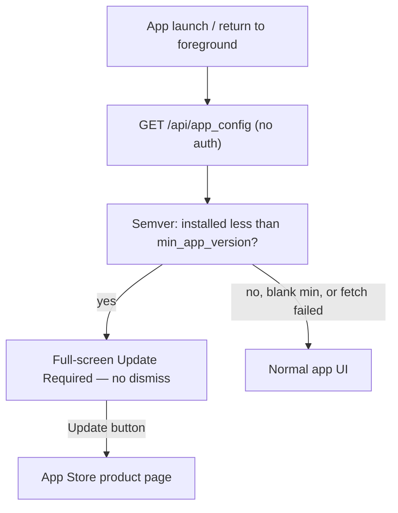

# Force-update gate architecture

Reusable pattern for iOS apps that need a **hard, non-dismissible** “update required” wall, controlled by the server.

Reference implementation: **Hifz.World** (`com.nabeel.hifzworld`) + **hifzworld-api**.

---

## Goal

Block outdated installs from using the app until they update from the App Store — **only when you decide** a version is mandatory (critical bug, breaking API, security fix).

This is **not** “force every time a new build hits the store.” Phased rollouts and gradual adoption stay safe; you flip the gate after the good build is available.

---

## High-level flow



| Outcome | Condition |
| --- | --- |
| Show gate | Config fetched successfully **and** installed version &lt; `min_app_version` |
| Allow app | Min version blank/absent, installed ≥ min, **or** network/API error (**fail-open**) |

---

## Why server-controlled min version

| Approach | Pros | Cons |
| --- | --- | --- |
| **Env `MIN_APP_VERSION` (chosen)** | Flip without shipping client; control timing; safe during phased release | Requires one ops step after App Store is live |
| Auto via iTunes lookup “latest version” | Zero ops | Traps users mid-rollout; false positives; harder to soften |

Default: if `MIN_APP_VERSION` is empty → **no gate**.

---

## Backend contract

### Endpoint

```
GET /api/app_config
Authorization: none
```

### Response

```json
{
  "min_app_version": "1.2.0",
  "app_store_id": "1234567890"
}
```

| Field | Meaning |
| --- | --- |
| `min_app_version` | Marketing version string (`CFBundleShortVersionString` style). `null` or omit/blank → no gate |
| `app_store_id` | Numeric App Store Connect **Apple ID** for the app (App Information). Used only for the Update deep link |

### Config source

Prefer **environment / Figaro** so Railway (or equivalent) can change values without redeploying code:

| Env | Purpose |
| --- | --- |
| `MIN_APP_VERSION` | e.g. `1.2.0` |
| `IOS_APP_STORE_ID` | e.g. `6740123456` |

Example Rails controller sketch:

```ruby
def show
  render json: {
    min_app_version: ENV["MIN_APP_VERSION"].to_s.strip.presence,
    app_store_id: ENV["IOS_APP_STORE_ID"].to_s.strip.presence
  }
end
```

Must be reachable **without** a user token (gate runs before / without sign-in).

---

## Client architecture

### Pieces

1. **Config fetch** — unauthenticated GET to your API’s `app_config`
2. **Installed version** — `Bundle.main` → `CFBundleShortVersionString`
3. **Compare** — numeric semver: strip non-digits per segment, compare component-wise (`1.2.0` &gt; `1.1.9`)
4. **Result model** — e.g. `{ blocked, minVersion, installed, appStoreId }`
5. **Root gate UI** — when `blocked`, replace root content with Update Required (not a dismissible sheet)
6. **Triggers** — run check on bootstrap **and** `UIApplication.willEnterForegroundNotification`

### Fail-open (required)

Any of these → `blocked: false`:

- Timeout / offline / DNS failure
- Non-2xx response
- JSON decode failure
- Missing / blank `min_app_version`

Never brick users who cannot reach the API.

### Gate UI requirements

- Full screen; no close button; not a swipe-dismissible sheet
- Clear copy: update required + installed vs required versions
- Primary **Update** → `https://apps.apple.com/app/id{app_store_id}`
- If `app_store_id` missing, still show the wall (text-only); prefer always setting the env in production

### Bundle ID scoping (optional)

If one codebase ships multiple products, only run the check for the production bundle ID you care about. Other targets return `blocked: false`.

---

## Ops runbook

1. Ship new build to App Store; wait until that **marketing version** is available to download.
2. Set `MIN_APP_VERSION` to that version (e.g. `1.2.0`).
3. Confirm `IOS_APP_STORE_ID` is the app’s Apple ID (not a team member ID).
4. Kill/reopen an old install (or background → foreground) → should see the wall.
5. To turn off: clear `MIN_APP_VERSION` or set it ≤ what most users already have.

### Versioning tip

Use the same string users see in the App Store (marketing version), not build number (`CFBundleVersion`). Compare apples-to-apples with `CFBundleShortVersionString`.

---

## Out of scope (unless explicitly requested)

- Soft “optional update” banner
- Auto-force whenever a newer App Store build exists
- Blocking only after login
- Fail-closed offline mode

---

## Porting checklist (new app)

### API
- [ ] `GET /api/app_config` public JSON
- [ ] `MIN_APP_VERSION` + `IOS_APP_STORE_ID` env
- [ ] Document URLs / env in README

### iOS
- [ ] Unauthenticated fetch + semver compare + fail-open
- [ ] Non-dismissible Update Required root view + App Store button
- [ ] Check on launch + foreground
- [ ] Wire App Store Connect Apple ID into prod env after first listing exists

### Verify
- [ ] Blank min → app works
- [ ] Min higher than installed → wall
- [ ] Airplane mode + high min → app still opens (fail-open)
- [ ] Update link opens correct listing

---

## Hifz.World file map (reference)

| Layer | Location |
| --- | --- |
| API endpoint | `unzyla-api/app/controllers/api/app_config_controller.rb` |
| Route | `GET /api/app_config` |
| Client check | `unzyla/Core/Services/GlobalConfigService.swift` |
| Semver | `unzyla/Core/Utilities/Semver.swift` |
| Gate UI | `unzyla/Features/Recite/UpdateRequiredView.swift` |
| Root wiring | `unzyla/App/RootTabView.swift` + `ReciteViewModel.checkMinVersion` |
